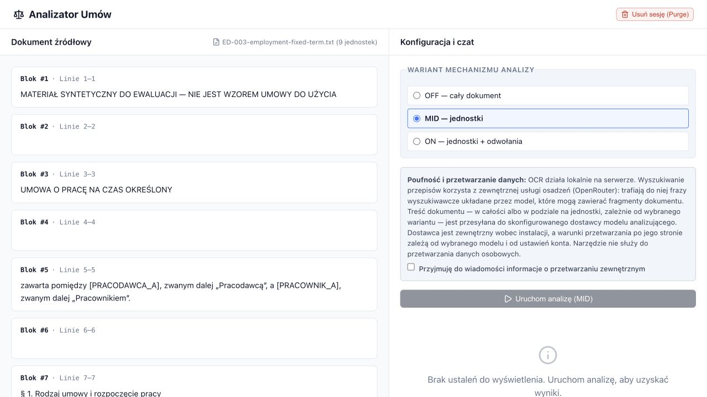

# Analiza prawna dokumentów

Asystent czyta polskojęzyczną umowę i wskazuje postanowienia, którym osoba bez wykształcenia
prawniczego powinna się przyjrzeć, wraz z przepisami polskiego prawa, z którymi każde z nich się
wiąże. Jest to prototyp badawczy, zbudowany na potrzeby pracy inżynierskiej. Informuje, ale nie
doradza i nie rozstrzyga, czy umowę podpisać. Każdy przedstawiony wniosek prawny trzeba sprawdzić
w źródle, na które się powołuje.

Użytkownik wgrywa umowę o pracę, umowę o świadczenie usług, umowę kredytu konsumenckiego lub
umowę spółki i otrzymuje listę ustaleń. Każde ustalenie wskazuje postanowienie, do którego się odnosi, przedstawia, na czym
polega problem, i przywołuje przepisy odnalezione w lokalnym korpusie polskich aktów prawnych,
zbudowanym na podstawie oficjalnej usługi ELI Sejmu. Tam, gdzie system nie potrafi rozstrzygnąć
pytania, mówi o tym zamiast zgadywać. Gdy jakiejś części dokumentu w ogóle nie przetworzył, informuje
o tym użytkownika.



## Trzy warianty analizy

Ten sam dokument można przekazać modelowi na trzy sposoby. Interfejs udostępnia wszystkie trzy,
a ewaluacja je porównuje:

| Wariant | Tekst przekazywany modelowi w jednym wywołaniu | Etykieta w interfejsie |
| --- | --- | --- |
| `OFF` | cały dokument jako jedna całość | *OFF — cały dokument* |
| `MID` | jedna jednostka analizy (paragraf, artykuł) naraz | *MID — jednostki* |
| `ON` | jedna jednostka wraz z treścią innych jednostek, do których się odwołuje | *ON — jednostki + odwołania* |

Warianty mają wspólny model, prompty, korpus, role agentów, narzędzia i limity pojedynczego wywołania.
Zmienia się tylko fragment dokumentu przekazywany modelowi, a wraz z nim liczba wywołań
przypadających na dokument i treść zapytań wyszukiwania. MID jest domyślny w interfejsie i to on
osiągnął najwyższą kompletność w obu seriach ewaluacji; liczby podaje tabela w sekcji
[Wyniki](#wyniki).

## Wymagania

- Docker i Docker Compose.
- `MODEL_API_KEY` — klucz do dostawcy zgodnego z OpenAI, udostępniającego model analizy przez ścieżkę
  `/responses`. Domyślnie jest to OpenRouter i `meta/muse-spark-1.3-contributor`.
- `OPENROUTER_API_KEY` — klucz do usługi reprezentacji wektorowych, czyli do OpenRoutera
  udostępniającego `qwen/qwen3-embedding-8b` w 4096 wymiarach. Jeden klucz OpenRoutera może obsłużyć
  obie zmienne.

Klucze są ustawiane osobno, ponieważ służą do uwierzytelniania w dwóch usługach. Dostawcę modelu
analizy można zmienić przez `MODEL_BASE_URL` i `MODEL_NAME`, wskazując usługę zgodną z OpenAI.
Zmiana dostawcy reprezentacji wektorowych wymaga natomiast przebudowy korpusu. Przechowuje on
wektory z jednego modelu, a backend odrzuca korpus, którego przestrzeń wektorowa różni się od tej,
w której wyznacza wektory zapytań. Po zmianie `EMBEDDINGS_BASE_URL` trzeba więc zbudować korpus ponownie
z użyciem nowej usługi. Takiego przebiegu nie można porównywać z zapisanymi wynikami.

## Szybki start

```bash
export MODEL_API_KEY="klucz-dostawcy-modelu"
export OPENROUTER_API_KEY="klucz-openroutera"
docker compose up --build
```

Compose odczytuje wartości tych zmiennych podczas wczytywania konfiguracji, więc trzeba je
wyeksportować przed jakimkolwiek poleceniem `docker compose` albo umieścić w pliku `.env` w tym katalogu.

Przy pierwszym uruchomieniu usługa seeder buduje korpus prawny, zanim backend zacznie obsługiwać
żądania. Pobiera jedenaście aktów wymienionych w `corpus/manifest.example.json`, dzieli je na artykuły
i wyznacza ich reprezentacje wektorowe. Na maszynie, na której sprawdzano to ostatnio, zajęło to
od trzech do sześciu minut. Dzieje
się tak tylko raz: kolejne uruchomienia korzystają z gotowego korpusu i pomijają ten krok.

Interfejs jest wtedy pod adresem **http://localhost:8000**. API HTTP działa pod
`http://127.0.0.1:8001`, a opisuje je `openapi.yaml`.

## Analiza dokumentu

1. Otwórz http://localhost:8000.
2. Wybierz wariant. MID jest zaznaczony domyślnie.
3. Zaznacz pole potwierdzające, że wiesz, jakie dane są wysyłane poza Twój komputer: rozpoznawanie znaków
   odbywa się lokalnie, wyszukiwanie wysyła do dostawcy reprezentacji wektorowych frazy ułożone przez
   model, które mogą zawierać fragmenty dokumentu, a wybrany tekst dokumentu trafia do dostawcy modelu
   analizy.
4. Wgraj umowę: `.txt`, `.docx`, `.doc` lub `.pdf`, do 25 MB.
5. Uruchom analizę i przeczytaj ustalenia. Wybranie jednego podświetla postanowienie, z którego
   pochodzi, i pokazuje przywołane przepisy.
6. Skorzystaj z czatu, aby dopytać o ustalenie lub je zakwestionować, a z dziennika agentów, aby
   zobaczyć, co każda rola zrobiła z każdą jednostką.

Treść dokumentu jest przechowywana przez godzinę. Po tym czasie nadal można czytać ustalenia
zakończonego przebiegu, ale tekst dokumentu nie jest już dostępny.

Katalog `evaluation-data/documents/` zawiera trzy krótkie umowy syntetyczne, które dobrze nadają się
do wypróbowania aplikacji.

## Korpus prawny

Seeder buduje korpus z manifestu aktów, z których każdy jest wskazany identyfikatorem ELI i datą stanu
prawnego, na jaką ma być odczytany. Pobiera tekst z `api.sejm.gov.pl`, dzieli go na artykuły, wyznacza
ich reprezentacje wektorowe i udostępnia kolekcję pod aliasem używanym przez backend.

- `corpus/manifest.example.json` — jedenaście aktów użytych w ewaluacji, w tym Kodeks cywilny, Kodeks
  pracy i ustawa o prawach konsumenta. 3317 jednostek.
- `corpus/manifest.smoke.json` — dwa akty; pozwala szybciej zbudować korpus, aby wypróbować system.

Identyfikator wersji korpusu zależy od jego zawartości: ten sam manifest i niezmienione źródła dają
ten sam identyfikator. `CORPUS_MANIFEST` wskazuje manifest, a `/api/v1/config` podaje wersję korpusu
używaną przez backend.

```bash
CORPUS_MANIFEST=/app/corpus/manifest.smoke.json docker compose up --build
```

## Konfiguracja

| Zmienna | Wartość domyślna | Opis |
| --- | --- | --- |
| `MODEL_API_KEY` | — (wymagana) | Klucz API dostawcy modelu |
| `MODEL_BASE_URL` | `https://openrouter.ai/api/v1` | Punkt końcowy udostępniający ścieżkę OpenAI `/responses` |
| `MODEL_NAME` | `meta/muse-spark-1.3-contributor` | Identyfikator modelu |
| `MODEL_EXTRA_HEADERS` | _(nieustawiona)_ | Obiekt JSON z dodatkowymi nagłówkami wymaganymi przez dostawcę; domyślny dostawca ich nie potrzebuje |
| `EMBEDDINGS_BASE_URL` | `https://openrouter.ai/api/v1` | Punkt końcowy `/v1/embeddings` |
| `OPENROUTER_API_KEY` | _(nieustawiona)_ | Klucz przesyłany jako token Bearer wyłącznie do serwera OpenRoutera |
| `EMBEDDINGS_PROVIDER` | `deepinfra` | Dostawca, z którego router ma korzystać, bez przełączania na zastępczego; pusta wartość przywraca jego równoważenie obciążenia |
| `CORPUS_MANIFEST` | `/app/corpus/manifest.example.json` | Manifest określający zawartość korpusu prawnego |
| `CORPUS_SNAPSHOT_ID` | _(nieustawiona)_ | Określa jedyną wersję korpusu dopuszczoną do pomiaru |
| `EVALUATION_BATCH_OPEN` | `false` | Umożliwia wykonanie jednej partii pomiarowej i blokuje funkcje interaktywne |
| `MODEL_DEV_API_KEY` | — (wymagana przy `compose.dev.yaml`) | Klucz API dostawcy modelu używanego podczas prac rozwojowych |
| `MODEL_DEV_BASE_URL` | `https://opencode.ai/zen/go/v1` | Adres usługi modelu do prac rozwojowych, używany wyłącznie z `compose.dev.yaml` |
| `MODEL_DEV_NAME` | `muse-spark-1.3-contributor` | Identyfikator modelu w tym punkcie końcowym |
| `MODEL_DEV_EXTRA_HEADERS` | — (wymagana przy `compose.dev.yaml`) | Dodatkowe nagłówki wymagane przez dostawcę; usługa pod powyższym adresem odrzuca żądanie bez `x-opencode-session`, a `{}` oznacza brak dodatkowych nagłówków, jeśli dostawca ich nie wymaga |

## Konfiguracja rozwojowa i pomiarowa

Sam `compose.yaml` uruchamia konfigurację pomiarową z dostawcą modelu analizy użytym do uzyskania
zapisanych wyników. Do prób podczas prac rozwojowych można użyć tańszej usługi. Plik
`compose.dev.yaml` zmienia ustawienia połączenia z modelem:

```bash
docker compose -f compose.yaml -f compose.dev.yaml up --build
```

Ustaw oba klucze: `MODEL_API_KEY` dla konfiguracji pomiarowej i `MODEL_DEV_API_KEY` dla rozwojowej.
Konfigurację wybierasz przez pliki przekazane do Compose.
`MODEL_API_KEY` pozostaje wymagany w obu przypadkach, bo Compose odczytuje wartości zmiennych
z `compose.yaml` przed połączeniem konfiguracji z obu plików.

Samo `docker compose up` uruchamia aplikację z dostawcą analizy i manifestem korpusu użytymi
w zapisanym eksperymencie. Aby przeliczyć opublikowane statystyki z zapisanych ocen, uruchom
`uv run python scripts/evaluate.py report --offline`. Nowe wywołania modelu dają nowe odpowiedzi.
Instalacja, na której prowadzi się wyłącznie prace rozwojowe, może zmienić swoją domyślną
konfigurację, nie zmieniając zachowania kopii. Wystarczy ustawić `COMPOSE_FILE` w pliku `.env`, który
Compose czyta z tego katalogu:

```
COMPOSE_FILE=compose.yaml:compose.dev.yaml
```

Przy uruchamianiu pomiaru wskaż wtedy plik wprost: `docker compose -f compose.yaml`.

Zmiana dotyczy wyłącznie modelu analizy. Usługa reprezentacji wektorowych zachowuje swój adres
z powodu podanego w sekcji [Wymagania](#wymagania). Konfiguracja rozwojowa ustawia też `EVALUATION_BATCH_OPEN`
na false, więc uruchomiona w ten sposób aplikacja nie obsłuży partii pomiarowej. Sposób obsługi tego
samego modelu różni się między usługami, więc przebiegi z konfiguracji rozwojowej nie są porównywalne
z zapisanymi wynikami i nie stanowią materiału pomiarowego.

## Wolumeny danych

Dane są przechowywane w dwóch nazwanych wolumenach: `postgres-data` zawiera metadane przebiegów,
a `qdrant-data` korpus. Seeder odtwarza korpus z manifestu, więc usunięcie `qdrant-data` wymaga
jedynie czasu na ponowną budowę. Metadanych przebiegów nie można w ten sposób odtworzyć. Dlatego
poniższa instrukcja wskazuje do usunięcia tylko wolumen korpusu:
`docker compose down --volumes` usunęłoby również metadane przebiegów.

Baza wektorowa używa obrazu `qdrant/qdrant:v1.19.1` o ustalonym skrócie. Qdrant wymaga migracji danych
kolejno przez wersje pośrednie (minor), więc wolumen zapisany przez serwer starszy niż 1.19 i uruchomiony
od razu pod 1.19 wczytuje się bez większości punktów: seeder nadal rozpoznaje tę wersję korpusu jako gotową,
a backend odrzuca wtedy zbyt małą ich liczbę. Obsługiwana ścieżka aktualizacji to usunięcie tego
wolumenu i ponowne zbudowanie korpusu:

```bash
docker compose down
docker volume ls --filter name=_qdrant-data
docker volume rm artifact_qdrant-data
```

Najpierw wyświetl listę wolumenów, aby ustalić pełną nazwę tego, który chcesz usunąć.
Nazwa zaczyna się od nazwy projektu Compose. Uruchomiony z katalogu o nazwie `artifact` projekt nazywa się
`artifact`, więc wolumen to `artifact_qdrant-data`; pod inną nazwą projektu usuń ten
`<przedrostek>_qdrant-data`, który widnieje na liście dla tej instalacji, i zostaw wszystkie inne.
Jeśli lista jest pusta, starego wolumenu nie ma. Po ponownym zbudowaniu korpusu sprawdź
`/api/v1/health/ready` i wykonaj próbne wyszukiwanie, aby potwierdzić, że instalacja działa poprawnie.

## Testy i kontrole

```bash
uv sync --locked --all-groups
npm ci --prefix web

uv run ruff check backend seeder tests scripts
uv run mypy
uv run pytest --ignore=tests/smoke -q
npm test --prefix web
```

Powyższe polecenie pomija katalog `tests/smoke`: jeden z jego dwóch plików uruchamia testy z użyciem
Dockera, a drugi zużywa tokeny u dostawcy modelu i uruchamia się tylko z `LIVE_PROVIDER_SMOKE=1`.

## Odtworzenie ewaluacji

Katalog `evaluation-data/` zawiera pięć dokumentów, klucz 78 oczekiwanych ustaleń,
protokół pomiaru, surowe przebiegi obu serii oraz każdą zapisaną odpowiedź sędziego. Plik
`evaluation-data/README.md` opisuje zawartość poszczególnych plików; poniższe polecenia warto uruchomić
najpierw.

```bash
# Przelicz każdą miarę jakości z zapisanych ocen. Bez sieci, bez wywołań modelu.
uv run python scripts/evaluate.py report --offline

# Sprawdź zbiór względem jego manifestu: skróty, podziały, pomiary wczytania
uv run python scripts/validate_evaluation_data.py
```

Polecenie tworzące raport offline odczytuje dane wejściowe i zapisane oceny, po czym nadpisuje
`evaluation-data/results/judge/report.json`. Niepełny zestaw daje niepełny raport i niezerowy kod
wyjścia.

Ocenę jakości wykonuje GPT-5.6 Sol jako sędzia, w środowisku oddzielonym od aplikacji. Otrzymuje
zapisane ustalenia asystenta, klucz i teksty źródeł. Uwierzytelnianie odbywa się przez konto ChatGPT
z subskrypcją, a nie przez dostawcę modelu używanego w aplikacji. Polecenie
`uv run python scripts/evaluate.py run --workers 4` ocenia całe przebiegi, których jeszcze brakuje;
każda próba zapisuje się na bieżąco, więc przerwane polecenie da się wznowić. To jedyna ścieżka
punktowania w artefakcie. Logowanie, przygotowanie źródeł i kontrolę sędziego opisuje
`evaluation-data/README.md`.

Nowe przebiegi asystenta wymagają działającego backendu z włączonym trybem pomiarowym:

```bash
EVALUATION_BATCH_OPEN=true docker compose up -d backend
uv run python scripts/run_evaluation.py --split development --arms off,mid,on \
  --out evaluation-data/results/local/
```

`EVALUATION_BATCH_OPEN` ma domyślnie wartość `false` na użytek interaktywny, a program uruchamiający
odmawia startu, dopóki backend nie zgłosi wartości `true`. Katalog `evaluation-data/results/local/`
służy do przechowywania tymczasowych wyników. Wyniki prób, które warto zachować, trafiają do katalogu
oznaczonego datą w `evaluation-data/results/development/`.

Skrypt `scripts/check_runs.py` sprawdza, czy porównywane przebiegi działały w zgodnych konfiguracjach.
Odczytuje metadane przebiegów z bazy wskazanej przez `DATABASE_URL` i otwiera ją tylko do odczytu.
Otwarcie bazy w trybie zapisu zakończyłoby w niej przebiegi oznaczone jako trwające. Narzędzie
diagnostyczne nie może zmieniać ich statusów podczas pomiaru.

```bash
# Sprawdź zgodność konfiguracji wewnątrz obu serii i między nimi
uv run python scripts/check_runs.py \
  --batch evaluation-data/results/final/2026-09-08-holdout \
  --batch evaluation-data/results/final/2026-09-09-holdout-series-2
```

Bez `--batch` skrypt odczytuje wszystkie zakończone przebiegi z bazy. Jeśli zawiera ona więcej niż
jedną serię tego samego porównania, nie wiadomo, które przebiegi zestawić ze sobą.

Obie pełne serie obejmują te same trzy dokumenty i mają w protokołach oraz raportach numery 1 i 2.

## Wyniki

Dwie serie, 18 przebiegów, 410 ustaleń. GPT-5.6 Sol ocenił 301 ustaleń merytorycznych względem klucza
i tekstów źródeł; pozostałe 109 to odpowiedzi, które nie zawierają ustalenia merytorycznego —
niepewność, brak związku z korpusem, brak podstawy prawnej albo fragment nieprzetworzony przez
przebieg — i liczy się je osobno. Kontrola sędziego wypadła pomyślnie: 10 zgodnych ocen końcowych
na 12 względem ocen referencyjnych przygotowanych z pomocą modelu.

| Seria | Wariant | Kompletność (%) | Precyzja (%) | Potwierdzone (%) | Czas analizy (s) | Tokeny analizy |
| --- | --- | ---: | ---: | ---: | ---: | ---: |
| 1 | OFF | 14,2 | 66,7 | 60,0 | 1 272 | 2 199 674 |
| 1 | MID | 52,4 | 72,7 | 71,6 | 1 002 | 4 265 721 |
| 1 | ON | 47,5 | 67,8 | 66,7 | 974 | 4 682 493 |
| 2 | OFF | 18,6 | 75,0 | 71,4 | 1 480 | 2 209 532 |
| 2 | MID | 46,6 | 67,1 | 66,2 | 1 107 | 4 114 756 |
| 2 | ON | 35,1 | 57,4 | 56,5 | 1 005 | 4 967 276 |

Kompletność to średnia po dokumentach o jednakowej wadze, liczona względem 78 oczekiwań klucza.
Precyzję obliczono łącznie dla ustaleń rozstrzygniętych; przy obliczaniu udziału potwierdzonych
w mianowniku uwzględniono także ustalenia nierozstrzygnięte. Czasy i tokeny zsumowano dla trzech
dokumentów. Opłat za poszczególne przebiegi nie zapisano.

MID ma najwyższą kompletność w obu seriach. Wariant ON, który dokłada treść przywołanych fragmentów,
ma niższą kompletność i precyzję niż MID, a zużywa więcej tokenów. Nawet MID pokrywa tylko około
połowy oczekiwanych zagadnień. Dokładne ułamki, wyniki dla poszczególnych dokumentów, porównania
i zużycie zasobów podczas oceniania są w [`report.json`](evaluation-data/results/judge/report.json).

## Ograniczenia

- Wynik ma charakter informacyjny. Nie jest poradą prawną, nie jest audytem i nie jest stwierdzeniem,
  że umowę można bezpiecznie podpisać. Ustalenie to powód, by przeczytać przywołany przepis, a nie
  wniosek.
- Powyższe wyniki to oceny modelu oparte na źródłach, a nie opinia prawnika.
- Kompletność mierzono względem klucza 78 oczekiwań dla trzech badanych dokumentów. Nie mówi ona nic
  o polskich umowach w ogóle.
- Korpus jest zamrożoną kopią jedenastu aktów odczytanych na podaną datę. Zmian wprowadzonych po tej
  dacie w nim nie ma, a system podaje, ile znanych nowelizacji dany akt nie uwzględnia.
- Ustalenia i przywołania przepisów tworzy model językowy. Może on pomijać postanowienia,
  przywoływać nieistniejące przepisy lub niewłaściwie stosować istniejące.

## Licencja i ponowne wykorzystanie

- Kod: MIT, zobacz [`LICENSE`](LICENSE).
- Syntetyczne dokumenty ewaluacyjne i własne zapisy ewaluacyjne projektu: CC0 1.0, zobacz
  [`evaluation-data/LICENSE.md`](evaluation-data/LICENSE.md).
- Dwa wzory umów w `evaluation-data/source-files/` pochodzą z Ministerstwa Rozwoju i Technologii
  i są udostępniane dalej na jego warunkach ponownego wykorzystywania informacji sektora publicznego.
  Zachowaj informacje o źródle, autorstwie i redakcji, znaczniki czasu oraz notę o przetworzeniu
  z pliku [`evaluation-data/LICENSE.md`](evaluation-data/LICENSE.md) razem z kopiami tych plików.
  Plik `evaluation-data/source-files/acquisition.json` zapisuje ich pobranie i usunięcie metadanych.
- Korpus wyszukiwania działający w aplikacji jest odtwarzany z API wydawcy. Teksty przepisów potrzebne
  do ewaluacji offline znajdują się w `evaluation-data/judge/sources/provisions.json`, wraz z ich
  urzędowymi identyfikatorami ELI. Zobacz [`evaluation-data/LICENSE.md`](evaluation-data/LICENSE.md).
